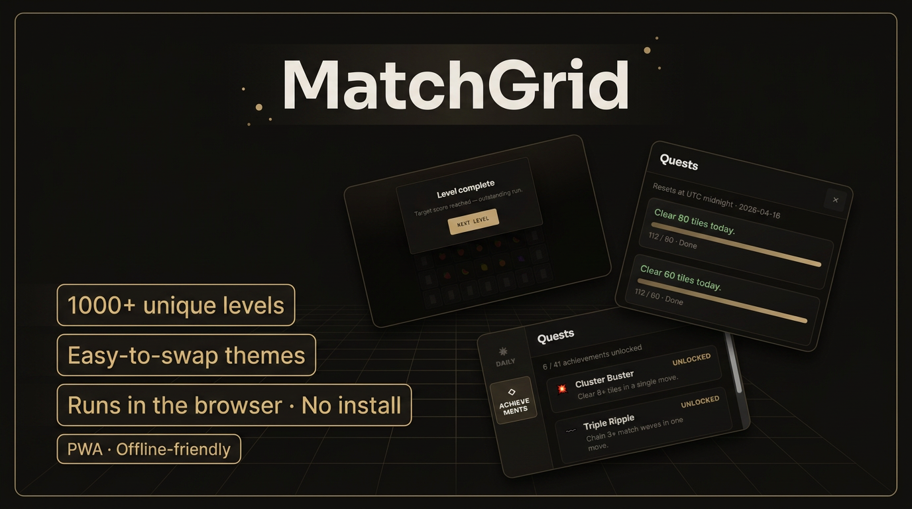

<div align="center">

# MatchGrid

**A fast, themeable match‑3 puzzle for the browser.**  
Swap tiles, clear matches, ride cascades, and progress through a long campaign — then reskin the board with declarative themes (emoji, sprites, backgrounds) without touching core game logic.

<br />

[](https://www.typescriptlang.org/)
[](https://vitejs.dev/)
[](https://vitest.dev/)
[](https://playwright.dev/)
[](./LICENSE)

<br />

[](https://matchgrid-game.vercel.app)
[](https://x.com/WebRaizo)

<sub>Production: <a href="https://matchgrid-game.vercel.app">matchgrid-game.vercel.app</a> (Vercel).</sub>

<br /><br />

<span id="preview"></span>



<sub>Promo thumbnail: levels, themes, browser/PWA callouts.</sub>

<br /><br />

**Preview video**

<video src="docs/MatchGrid.mp4" controls playsinline muted width="720" style="max-width:100%; border-radius:6px;">
  Video preview: <a href="docs/MatchGrid.mp4">MatchGrid.mp4</a>
</video>

<sub>If the player does not show on GitHub, open <a href="./docs/MatchGrid.mp4"><code>docs/MatchGrid.mp4</code></a> directly.</sub>

</div>

<br />

## Table of contents

- [Preview](#preview)
- [Highlights](#highlights)
- [Features](#features)
- [Stack](#stack)
- [Getting started](#getting-started)
- [Scripts](#scripts)
- [Query string parameters](#query-string-parameters)
- [Repository layout](#repository-layout)
- [Customization](#customization)
- [Themes](#themes)
- [Levels & campaign](#levels--campaign)
- [Deploy (static hosting)](#deploy-static-hosting)
- [Testing](#testing)
- [CI](#ci)
- [Contributing](#contributing)
- [Roadmap](#roadmap)
- [License](#license)

---

## Highlights

| | |
| :--- | :--- |
| **Engine-first** | Core rules live in plain TypeScript — straightforward to test and extend. |
| **Content without redeploy drama** | Themes and level definitions live in TypeScript/data — ship new looks or packs without forking the engine. |
| **Static by default** | No backend — ideal for Vercel, Netlify, GitHub Pages, or any static CDN. |
| **PWA-ready** | Installable shell with offline-friendly precaching via `vite-plugin-pwa`. |
| **Contributor-friendly** | Great first PRs: themes, levels, UI polish, tests. |

---

## Features

- **Match‑3 rules** — legal swaps only, line detection, clears, obstacle-aware gravity, refills, cascades.
- **Obstacles** — blocked cells (`BLOCKED`) split columns and break lines; per-level ASCII (`#` / `.`) or boolean grids.
- **Campaign** — large ordered level set with varying board sizes, obstacles, and **target score** goals; prev/next level and **new board** (new RNG seed).
- **Difficulty modes** — Relaxed (no timer), Normal (level timer), Time pressure (stricter clock). First visit can show a picker; `?difficulty=` overrides storage.
- **Progression** — daily missions, achievements, and stats persisted in **localStorage** (see `src/progression/`).
- **Themes** — declarative manifests (e.g. fruit / emoji); shell styling via CSS variables; `?theme=` switch.
- **Audio** — sound effects with a mute toggle (`public/sounds/`, multiple formats tried at runtime).
- **Accessibility** — high-contrast mode; **keyboard** navigation on the board (arrows + Enter/Space) with roving focus.
- **Vitest** — unit tests for RNG mixing, matching, gravity, legality, levels.
- **Playwright** — end-to-end smoke tests (`e2e/`), run locally (not part of default CI — see [CI](#ci)).

---

## Stack

| Layer | Choice |
| ------ | ------ |
| Tooling | [Vite](https://vitejs.dev/) |
| Language | [TypeScript](https://www.typescriptlang.org/) |
| Unit tests | [Vitest](https://vitest.dev/) (`src/**/*.test.ts`) |
| E2E tests | [Playwright](https://playwright.dev/) (`e2e/*.spec.ts`) |
| PWA | [vite-plugin-pwa](https://vite-pwa-org.netlify.app/) |
| Hosting | Any static host ([Vercel](https://vercel.com/), [Netlify](https://www.netlify.com/), GitHub Pages, …) |

---

## Getting started

```bash
git clone https://github.com/<your-username>/matchgrid.git
cd matchgrid
npm install
npm run dev
```

Open the URL printed by Vite (usually `http://localhost:5173`).

**Production build**

```bash
npm run build
npm run preview
```

Output is written to `dist/` — deploy that folder to your host.

---

## Scripts

| Command | Description |
| --------| ------------|
| `npm run dev` | Vite dev server |
| `npm run build` | Production bundle → `dist/` |
| `npm run preview` | Preview the production build locally |
| `npm test` | Run Vitest once |
| `npm run test:watch` | Vitest watch mode |
| `npm run test:e2e` | Playwright tests (starts dev server via config) |

**Playwright:** first time on a machine, install browsers:

```bash
npx playwright install
```

---

## Query string parameters

| Param | Example | Effect |
| ----- | -------- | ------ |
| `level` | `?level=2` | Zero-based index into the level catalog (`src/levels/catalog.ts`). |
| `seed` | `?seed=42` | Reproducible RNG for the starting board (per-level salt still applies). |
| `theme` | `?theme=emoji` | Built-in theme id (e.g. `emoji` or default fruit). |
| `difficulty` | `?difficulty=normal` | `relaxed` \| `normal` \| `pressure` — skips the first-run gate when set. |

---

## Repository layout

```
├── .github/workflows/     # CI: unit tests + production build
├── docs/                  # README media (thumbnail, preview video)
├── e2e/                   # Playwright E2E specs
├── public/                # Static assets (PWA icon, sounds, …)
├── src/
│   ├── a11y/              # Contrast preference
│   ├── app/               # Board session, difficulty
│   ├── audio/             # Sound loading & playback
│   ├── engine/            # Grid, match, gravity, cascade, RNG, unit tests
│   ├── levels/            # Campaign generator, catalog, obstacles
│   ├── progression/     # Daily missions, achievements, storage
│   ├── render/            # DOM board, tile glyphs, keyboard UX
│   ├── theme/             # Theme manifests and shell styling
│   └── ui/                # Quests / achievements panels
├── index.html
├── vite.config.ts         # Vite + PWA plugin
├── vitest.config.ts
├── playwright.config.ts
├── package.json
├── LICENSE
└── README.md
```

---

## Customization

MatchGrid is **MIT-licensed** — fork, tweak, and ship your own build. You do **not** need to touch the match‑3 **engine** (`src/engine/`) to reskin the game or ship new content; deeper rule changes live there when you need them.

| Goal | Where to look |
| ---- | ------------- |
| **New look (tiles, backdrop, colors)** | `src/theme/` — add or edit theme manifests; shell styling via CSS variables. See [Themes](#themes). |
| **Global layout & chrome** | `src/styles.css`, markup strings in `src/main.ts`. |
| **Campaign length, board sizes, obstacles, targets** | `src/levels/campaign.ts`, `src/levels/catalog.ts`, `src/levels/types.ts`. See [Levels & campaign](#levels--campaign). |
| **Daily missions & achievement text / targets** | `src/progression/definitions.ts` (lists), `src/progression/logic.ts` (rules). |
| **Difficulty timing & “game over on time up”** | `src/app/difficulty.ts`, `src/engine/constants.ts`. |
| **Sound effects** | Drop files under `public/sounds/` (see `public/sounds/README.txt`); playback mapping in `src/audio/gameSounds.ts`. |
| **PWA name, icons, theme colors** | `vite.config.ts` (`VitePWA` `manifest`), `public/pwa-icon.svg`, `index.html` meta. |
| **Board focus & keyboard UX** | `src/render/domBoard.ts`. |
| **High contrast preference** | `src/a11y/contrastPreference.ts`. |
| **Match rules, gravity, specials** | `src/engine/` — for advanced forks; add or adjust tests under `src/**/*.test.ts`. |

**Quick tuning without new code:** use [query string parameters](#query-string-parameters) (`level`, `seed`, `theme`, `difficulty`) for demos and QA.

---

## Themes

Themes are **declarative manifests** — not hard-coded branches in the renderer.

Each theme can define:

- **Backdrop** — solid color, CSS gradient, and/or a full-bleed image.
- **Tiles** — map logical tile IDs to **emoji** and/or **image** sources (`public/` paths or HTTPS URLs).
- **UI tokens** _(optional)_ — accents and text colors so panels stay readable on busy backgrounds.

Runtime switching (`?theme=<id>`) keeps demos shareable: one link, many looks.

---

## Levels & campaign

The default campaign has **`CAMPAIGN_LEVEL_COUNT`** stages (see `src/levels/campaign.ts`), exported as **`LEVELS`** from **`src/levels/catalog.ts`**. Each `LevelDefinition` includes:

| Field | Role |
| ------ | ----- |
| `id`, `title` | Identity and display copy |
| `rows`, `cols` | Board size |
| `salt` | Mixed into the global seed so each level differs when `?seed=` is fixed |
| `targetScore` | Points from cleared tiles needed to complete the stage |
| `obstaclePattern` | Optional: one string per row; `#` = block, `.` = playable |
| `obstacles` | Optional: `boolean[][]` instead of a pattern |

To change how many stages are generated, adjust **`CAMPAIGN_LEVEL_COUNT`** in `campaign.ts`.

---

## Deploy (static hosting)

1. Push this repository to GitHub (or another Git host).
2. Connect the repo to your host (e.g. Vercel **Import Project**).
3. **Build command:** `npm run build`  
   **Output directory:** `dist`
4. Deploy. The **Live demo** badge at the top of this README points at the production URL (update it if the domain changes).

No database or server runtime — the game runs entirely in the browser.

---

## Testing

**Unit tests (Vitest)**

```bash
npm test
```

Covers deterministic RNG mixing, match detection (including obstacles), gravity segments, legal moves, and campaign helpers. Add cases under `src/**/*.test.ts`.

**End-to-end (Playwright)**

```bash
npx playwright install   # once per machine
npm run test:e2e
```

---

## CI

On push and pull requests targeting `main` or `master`, GitHub Actions runs `npm ci`, `npm test`, and `npm run build`. See [`.github/workflows/ci.yml`](./.github/workflows/ci.yml).

E2E tests are **not** run in CI by default (Playwright browser install adds time and setup). Run `npm run test:e2e` locally before releases or add a separate workflow if you want E2E in the cloud.

---

## Contributing

Focused contributions welcome:

1. **Themes** — new manifest + assets following existing conventions (`src/theme/`).
2. **Levels / campaign** — balanced changes with a short note in the PR.
3. **Engine fixes** — prefer a minimal repro or a new/updated unit test.

Please keep **user-facing strings and code comments in English** so the project stays approachable globally.

---

## Roadmap

Ideas (not commitments):

- More theme and level packs.
- Optional CI job for Playwright on a schedule or manual dispatch.
- Further accessibility polish (motion preferences, additional shortcuts).

---

## License

Distributed under the **MIT License** — see [LICENSE](./LICENSE).

---

## Disclaimer

MatchGrid is an independent educational and portfolio project. The match‑3 genre is widely used; this codebase does not imply affiliation with any commercial game or trademark.
